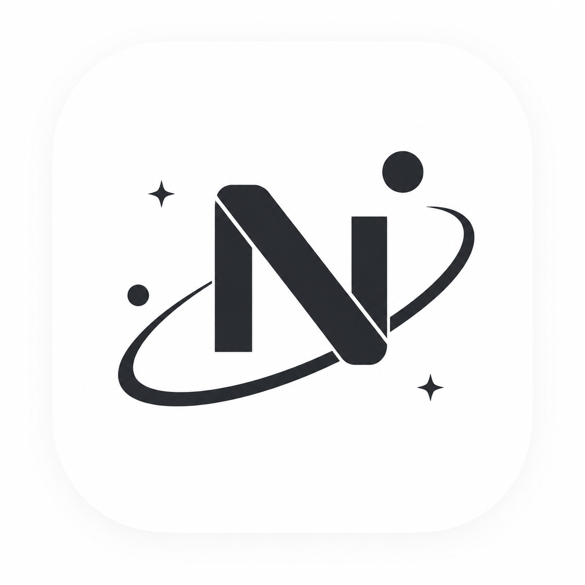

#  Nebula Admin

Nebula Admin是一个基于Spring Boot的前后端分离后台管理系统，内置RBAC权限体系（用户/角色/权限/菜单），并原生支持管理端 + 用户端的多端账号体系，可动态扩展更多端。

## 技术栈

- Java 17+
- Spring Boot 3.2.2
- Spring Data JPA
- MySQL 8.0+
- Redis 6.0+
- Sa-Token 1.38.0 (认证框架)
- Lombok
- RSA加密
- Vue 3 (前端)
- Element Plus 2.x (前端UI)
- Vite 5 (前端构建工具)
- Pinia (前端状态管理)
- Vue Router 4 (前端路由)

## 项目结构

```
nebula-admin/
├── backend/                 # 后端服务（Spring Boot）
│   ├── nebula-api/          # API模块，包含VO类（请求/响应对象）
│   ├── nebula-common/       # 公共模块，包含工具类、异常处理等
│   ├── nebula-system/       # 系统模块，包含核心业务逻辑
│   ├── nebula-web/          # Web模块，包含主应用程序和配置
│   └── pom.xml              # Maven 父 POM（依赖管理）
└── frontend/                # 前端应用（Vue 3 + Element Plus）
```

## 核心功能

### 认证与多端支持
- 双账号体系：管理端（loginType=admin）与用户端（loginType=user）完全隔离
- 登录接口按端拆分：`/auth/admin/**` 仅服务管理端，`/auth/user/**` 仅服务用户端
- 身份类型区分：后台用户（user_type=1）/ 普通用户（user_type=2），端与身份类型强校验
- token 内嵌 loginType 前缀（如 `admin_xxxx`），自描述所属端，各端共用 `Authorization` 请求头
- 端注册表 `ClientType` 驱动，新增端只需增加一行枚举

### 系统管理（RBAC）
- 用户管理：服务端分页 + 条件搜索（用户名/手机号），仅管理后台用户
- 角色管理、权限管理、菜单管理（树形）：分页/树查询 + 条件搜索
- 基于注解的角色/权限控制（`@SaCheckRole` / `@SaCheckPermission`）

### 用户管理
- 用户注册与登录（支持用户名登录和手机号登录）
- 用户信息管理（创建、查询、更新、删除）
- 管理员用户管理
- 用户唯一性校验（用户名、手机号）

### 安全特性
- RSA加密传输密码
- BCrypt密码哈希存储
- Sa-Token会话管理
- 基于注解的权限控制

### 数据安全
- 逻辑删除（软删除）
- 自动时间戳管理
- 数据库唯一性约束

## 多端支持

系统采用「身份 × 端」双轴设计：

```
身份类型（sys_user.user_type）      端（Sa-Token loginType）
  1=后台用户 ──────────── 管理端 (admin，/auth/admin/**，管理后台页面)
  2=普通用户 ─┬────────── 用户端 (user，/auth/user/**，H5/App/小程序共用)
             └────────── 后续新端：ClientType 注册表加一行 + 拦截路径
```

- **身份与端隔离**：后台用户进不了用户端，普通用户进不了管理端（登录时按 `user_type` 强校验）
- **token 自描述**：token 格式 `{loginType}_{随机串}`，`/auth/current` 解析前缀直接定位所属端
- **权限分支**：`StpInterfaceImpl` 按 loginType 分支，超级管理员（isAdmin）仅在管理端体系拥有 `*`
- **接口复用**：同一身份类型的多端（H5/App/小程序）共用一套 `/auth/user/**` 与业务接口

## 安装和运行

### 前置条件

- JDK 17或更高版本
- Maven 3.6或更高版本
- MySQL 8.0或更高版本
- Redis 6.0或更高版本
- Node.js 18或更高版本（前端使用 Vite 5，不支持 Node 16）
- npm 9或更高版本（随 Node.js 安装）

### 配置步骤

1. **克隆项目到本地**

2. **修改数据库配置**
   - 编辑 `backend/nebula-web/src/main/resources/application.yml` 文件
   - 修改 `spring.datasource` 部分的配置，设置正确的数据库连接信息
   ```yaml
   spring:
     datasource:
       url: jdbc:mysql://localhost:3306/your_database
       username: your_username
       password: your_password
   ```

3. **修改Redis配置**
   - 编辑 `backend/nebula-web/src/main/resources/application.yml` 文件
   - 修改 `spring.data.redis` 部分的配置，设置正确的Redis连接信息
   ```yaml
   spring:
     data:
       redis:
         host: localhost
         port: 6379
         password: your_redis_password
   ```

4. **构建项目**（在 `backend` 目录下执行）
   ```bash
   cd backend
   mvn clean package
   ```

5. **运行项目**
   ```bash
   java -jar backend/nebula-web/target/nebula-web-0.0.1-SNAPSHOT.jar
   ```

6. **启动前端**（在 `frontend` 目录下执行）
   ```bash
   cd frontend
   npm install
   npm run dev
   ```
   访问 `http://localhost:3000`

   > 提示：如果本机通过 nvm 管理多个 Node 版本，请先切换到 Node 18+（如 `nvm use 22.22.1`），否则 Vite 5 会因 Node 版本过旧而启动失败。

## 配置说明

### 管理员初始化配置

系统启动时会自动创建管理员用户，配置在 `application.yml` 中：

```yaml
admin:
  init:
    enable: true              # 是否启用管理员初始化
    username: admin           # 管理员用户名
    password: admin123        # 管理员密码
    phone: "13800000000"      # 管理员手机号
```

### RSA加密配置

在 `application.yml` 文件中，有以下RSA相关配置：

```yaml
rsa:
  enable: true  # 是否启用RSA加密
  publicKey: MIIBIjANBgkqhkiG9w0BAQEFAAOCAQ8AMIIBCgKCAQEAsQX4Zm2Xe9sFsgJS3qUGEjGxAZ7F0NfJBS3fxEI19zj0XPBwoOLg4J3q2s92BUb0NWC+ENW/PxXRxL2u77WozIFAZ8myUssnPKNVoJJ2dl5QyRseU05OahhLvWNIPEJNIVaDIb+Ra7fyABX0xRmezBFqF0rGLey6SRwUFzHY7C91ZixZJRPd2/opaz9AZtUv8kOCSncyUTbDhgvMyb4D8A9EyhIKaQyXEKgkyaQxeX90/KcmvuQ+h2VqKm2ZqGMRFkZClm+JBTHEaAegWMe3+ayONwmEt5Diu9eC49Pv1QETfVq4wxqP4aHMi8zaXCYacSjOz89YtrwswbzCK94o5QIDAQAB
  privateKey: MIIEvQIBADANBgkqhkiG9w0BAQEFAASCBKcwggSjAgEAAoIBAQCxBfhmbZd72wWyAlLepQYSMbEBnsXQ18kFLd/EQjX3OPRc8HCg4uDgneraz3YFRvQ1YL4Q1b8/FdHEva7vtajMgUBnybJSyyc8o1WgknZ2XlDJGx5TTk5qGEu9Y0g8Qk0hVoMhv5Frt/IAFfTFGZ7MEWoXSsYt7LpJHBQXMdjsL3VmLFklE93b+ilrP0Bm1S/yQ4JKdzJRNsOGC8zJvgPwD0TKEgppDJcQqCTJpDF5f3T8pya+5D6HZWoqbZmoYxEWRkKWb4kFMcRoB6BYx7f5rI43CYS3kOK714Lj0+/VARN9WrjDGo/hocyLzNpcJhpxKM7Pz1i2vCzBvMIr3ijlAgMBAAECggEAEgKpPeSXBbEoMG73lvLjvfyjxWYtupyFtXrwGgPhgTRgekc1Mk0682dlslrqp0lLhdXAqK5SjZzO8Y0Z7AYHtTzOPHEDLVTBenQkvVhBaLQaVIeni3K7XCR6KjvcaNMXDVYDs+6NYU/+9V7Gfzom05zO9i0zog8EefU7HwwBha/4GFPWpktl51OV6LpeHA8Ak4Vno1ap8I0bqmi2BxOQeFPNLCg0CvGQ3m3+dbNZSRFTu+Ta4aiiIAQ9GZllPLoTtrzaePfqGZqJM7Vqoj71ucxWJhgKgFoOFyBs4+zC3g1DofW/Ol+YwWKR2Qh1xf3+jqLDocRHCLfUbKh14Fu+8QKBgQDWtrHt4ZmXuJIcpPqlrlpYXT+4/BhHMdE8CgWfjDXV7tkeMXrFAQfNVLVGK9SdUi8f1cin3ZytHFg0l+G2N7Uv7+wODL6TOwnqLGoedCDEF0x1p39gOpnuTf2W5YvX69SWZZY7zki7sECUuzpKA9Y1fEJChIPqoLInLBAPd3Ut0QKBgQDTD/bao4cDWnQzu2u0fsn3a1HkcPE+3tEDiyzZ7KlcF0v1W48nG6Y7PGQFL2Ndz3btDFrVNTUvi/XVJKT8K67jvSkU+bWaZvhC4ocQDKelFK2sLYNX2n/SOQ8p6yfcNzkmyN97NuIBxFkjBUQG+VNC8vzdHJ70Jc4VbCzkvR7q1QKBgBhB06A4WI3XgEpUKS0GoZZSEpznfias7iKGT1RTFtHwhf7vQBt5nlQIOeKPmRmc604BbQXp94VnKl/muM1JReMAi/6aWf1wMhKOqf5+yCTfLPgt0Coi9LkDfp7JmB7wube0CmD/USBDLUigTlmGTXEFdMbnCbA8L2RVigr1R/vBAoGBAIUO92z20tMGX2ONsGTl2aWlfscpfK1KAzLctrXcQRjRhw1zX1gkUjPd6qBqM5aciDkBJPJszM7gyWZJ58kiMOtaAWA73IUujSx9avBvSfEEjEiTmM317cc2OZ0Ppt1p4xnUYS9odirvAdLWKwDKhfcbANbUiFEa1EUlIVhC8g7RAoGACPbO4rVcZNYh3mWaBW1BuuDwufVfY+88npHiq46xMRiJxW+Eqlhy9qnVUQKBHHuqvfLRxjCll9E5XgGsviNG79Vmjfep8fp3Nu90bct7UAujMZkYTj7aKRzwM7hX+oSf63M+/NCRTcy93023G1CuLvvKaMgumi/7uKH4iAYpyG0=
```

- `enable`: 是否启用RSA加密，默认为true，用于前后端交互时传输密码使用，建议在生产环境中启用
- `publicKey`: RSA公钥，用于加密密码
- `privateKey`: RSA私钥，用于解密密码

### Sa-Token配置

在 `application.yml` 文件中，有以下Sa-Token相关配置：

```yaml
sa-token:
  token-name: Authorization    # Token名称（各端共用）
  token-prefix: "Bearer"       # Token前缀
  timeout: 2592000             # Token有效期（30天）
  active-timeout: -1           # Token活跃期
  is-concurrent: true          # 是否允许并发登录
  is-share: false              # 是否共享Token
  is-log: true                 # 是否记录日志
  is-read-cookie: false        # 是否从Cookie读取
  is-read-header: true         # 是否从Header读取
  is-read-url-query: false     # 是否从URL参数读取
```

> Token 生成策略由 `SaTokenConfigure` 自定义：`{loginType}_{随机32位}`（如 `admin_8f3a...`），
> 使 token 自描述所属端。注意：修改 token 生成策略后，存量会话失效，需重新登录。

## 注意事项

1. 密码加密：系统支持RSA加密，在生产环境中建议保持启用状态
2. 数据库初始化：系统会自动创建表结构，首次运行时会自动建表
3. 安全：生产环境中请修改默认的RSA密钥对
4. 性能：系统使用Redis缓存用户信息，提高性能
